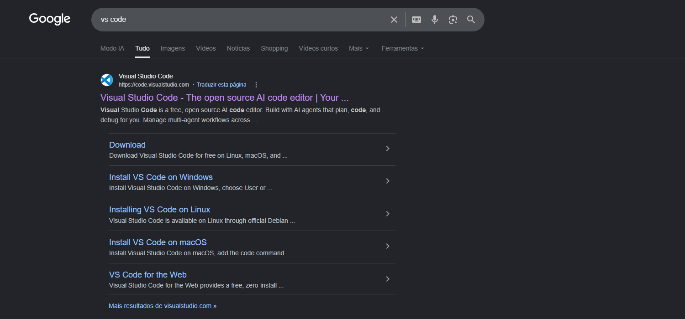
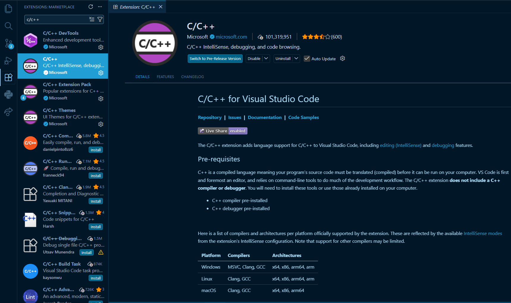
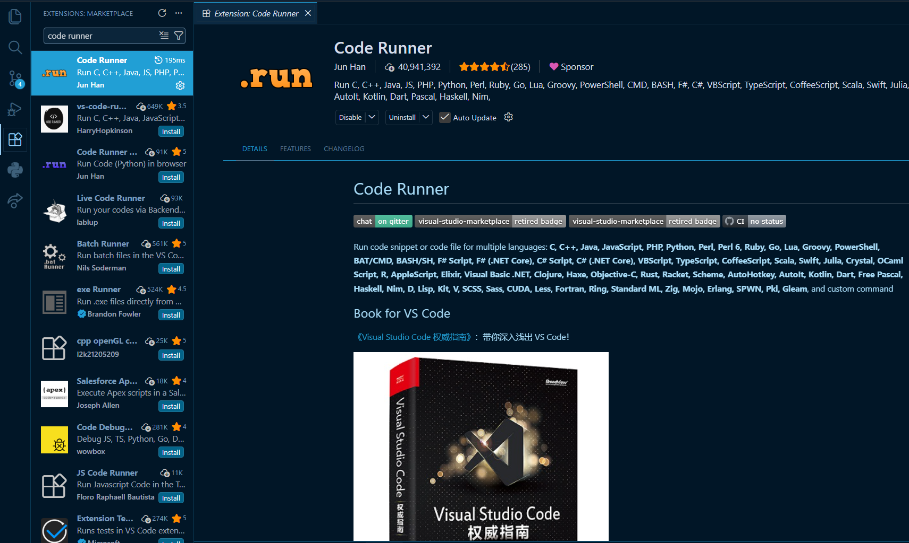
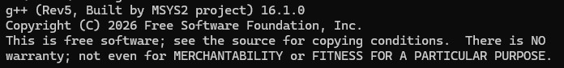

# Como utilizar o C++ pelo VS Code

Para esse tutorial estarei utilizando o VS Code como editor de texto, sinta-se livre para escolher aquele desejar, mas esteja ciente que a instalação pode ser diferente.
Além disso, vale ressaltar que este é um tutorial escrito do vídeo do canal **Bro Code**, então pode assistir a ele caso preferir.

## 1. Instale o VS Code
No seu navegador, pesquise por `vs code` e clique no primeiro link disponível.
Ou acesse diretamente esta tela através desse link: `https://code.visualstudio.com`



## 2. Instale as extensões
As extensões funcionam para auxiliar o desenvolvedor a programar, adicionando funcionalidades como AutoComplete, Highlights, Debug, etc.
Existem 2 extenções opcionais que irão te auxiliar durante sua programação em C++, são elas:

- C/C++

<br>

- Code runner


## 3. Instale um compilador

### 3.1 Linux
Abra o seu terminal e utilize os seguintes comandos:

Verifica se já está instalado
```
gcc -v
```

Atualiza os pacotes do Linux
```
sudo apt-get update
```

Instala o GCC
```
sudo apt-get install build-essential gdb
```

### 3.2 macOS
Abra o seu terminal e utilize os seguintes comandos:

Verifica se já está instalado
```
clang --version
```

Instala o GCC
```
xcode-select --install
```

### 3.3 Windows
1. Instale o MSYS2 através desse site: https://www.msys2.org
2. Na nova tela de prompt que aparecer, rode o comando da etapa 3
3. `pacman -S --needed base-devel mingw-w64-ucrt-x86_64-toolchain`
4. Pesquise por "configuraçoes" na barra de pesquisa do Windows
5. Depois pesquise por "editar as" e clique em **Editar as variáveis de ambiente para sua conta**
6. Na primeira seção, clique em Path
7. Depois em **Editar...** assim que exibir um highlight em Path
8. Clique em **Novo** e cole esse texto `C:\msys64\mingw64\bin`
9. Por fim, clique em **OK** em ambas telas

Para verificar se a instalação foi um sucesso, abra o cmd e digite `g++ --version`. Seu retorno deve ser algo parecido com isso:


## Fontes
- [Bro Code - C++ tutorial for beginners 👨‍💻](https://www.youtube.com/watch?v=S3nx34WFXjI&list=PLZPZq0r_RZOMHoXIcxze_lP97j2Ase2on)
- [Visual Studio Code - C/C++ Documentation](https://code.visualstudio.com/docs/languages/cpp)
